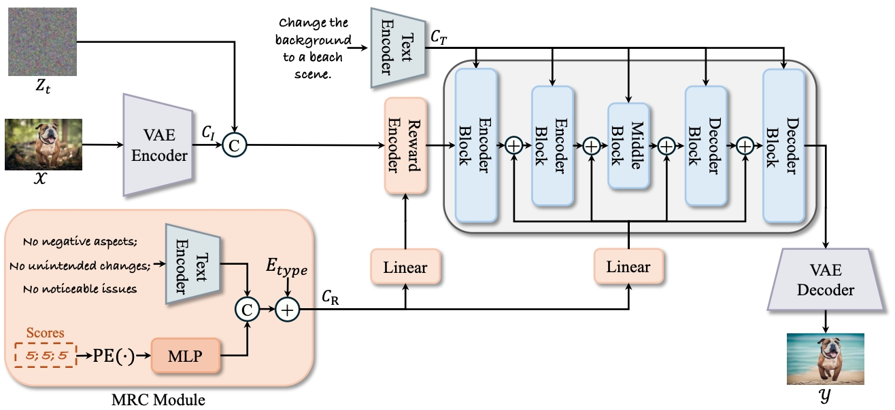

# Multi-Reward as Condition for Instruction-Based Image Editing
🔮 Welcome to the official code repository for [**Multi-Reward as Condition for Instruction-Based Image Editing**](https://arxiv.org/abs/2411.04713). We're excited to share our work with you, please bear with us as we prepare code. Stay tuned for the reveal!

## Architecture




## Implementation

### Dataset Preparation

```Download the dataset from Hugging Face```

- Training Images: [InstructPix2Pix](https://huggingface.co/datasets/timbrooks/instructpix2pix-clip-filtered)
- Training Reward: [RewardEdit-20K](https://huggingface.co/datasets/Gstar666/RewardEdit)
- Test Images and Instructions: [Real-Edit](https://huggingface.co/datasets/Gstar666/RewardEdit)


### Model Preparation

```Download the model from Hugging Face```

- Basic modules: [stable-diffusion-v1-5](https://huggingface.co/stable-diffusion-v1-5/stable-diffusion-v1-), [sdxl-vae-fp16-fix](https://huggingface.co/madebyollin/sdxl-vae-fp16-fix), [CLIP-ViT-H-14-laion2B-s32B-b79K](https://huggingface.co/laion/CLIP-ViT-H-14-laion2B-s32B-b79K), [clip-vit-large-patch14-336](https://huggingface.co/openai/clip-vit-large-patch14-336)
- Our trained models: [stage1_instruct_pix2pix](https://huggingface.co/Gstar666/Reward-InsPix2Pix/tree/main/stage1_instruct_pix2pix), [stage2_reward_instruct_pix2pix](https://huggingface.co/Gstar666/Reward-InsPix2Pix/tree/main/stage2_reward_instruct_pix2pix)


### Requirements


```shell
# Python 3.9, PyTorch 2.1.0 with CUDA 12.2
pip3 install -r requirements.txt
```

### Training and Evaluation
Please utilize the script provided below:
```shell
# Training
python3 -m torch.distributed.launch \
--nnodes $WORKER_NUM \
--node_rank $ID \
--nproc_per_node $WORKER_GPU \
--master_addr $METIS_WORKER_0_HOST \
--master_port $PORT \
train_sd15.py \
--stage=2 \ 
--pretrained_model_name_or_path=$STAGE1_MODEL_PATH \
--resolution=256 --random_flip \
--train_batch_size=4 --gradient_accumulation_steps=4 \
--max_train_steps=10000 --checkpointing_steps=500 \
--learning_rate=5e-5 --lr_warmup_steps=0 \
--conditioning_dropout_prob=0.05 \
--image_encoder_path=./CLIP-ViT-H-14-laion2B-s32B-b79K \
--output_dir=$OUTPUT_DIR


# Evaluation
python3 eval.py --model_path=$STAGE2_MODEL_PATH
```


### Citation
If you find this project useful in your research, please consider citing:
```
@article{gu2024multi,
  title={Multi-Reward as Condition for Instruction-based Image Editing},
  author={Gu, Xin and Li, Ming and Zhang, Libo and Chen, Fan and Wen, Longyin and Luo, Tiejian and Zhu, Sijie},
  journal={arXiv preprint arXiv:2411.04713},
  year={2024}
}
```
